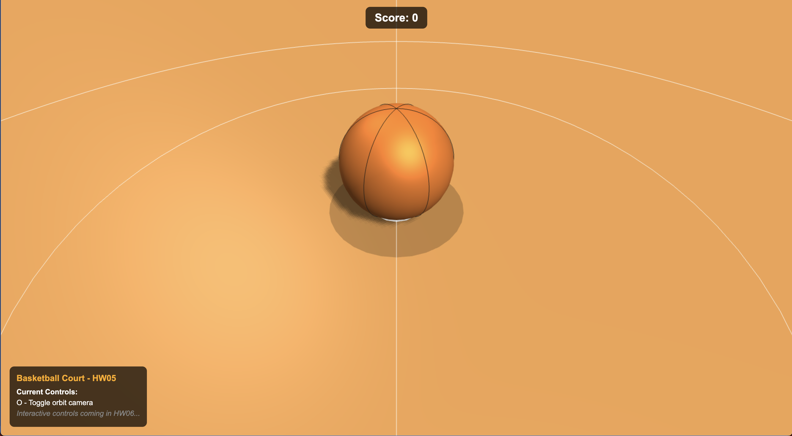

# Computer Graphics - Exercise 5 - WebGL Basketball Court

## Group Members

- Eric Gantman (207114851)
- Tom Bar (302278601)

## Getting Started

1. Clone this repository to your local machine: `git clone https://github.com/og-tombar/cg-ex05.git`
2. Make sure you have Node.js installed
3. Install dependencies: `npm i`
4. Start the local web server: `node index.js`
5. Open your browser and go to http://localhost:8000

## Extra Features Implemented

Our implementation covers all exercise requirements including the following extra features:

- More detailed court markings (free throw lines, key areas)
- Enhances lighting
- More detailed hoop models
- Beautiful cosmic space skybox as scene background texture

## External Assets

- [Procedurally Generated Space Skybox](https://tools.wwwtyro.net/space-3d/index.html)

## Screenshots

Overview 

Hoop Closeup 

Ball 
